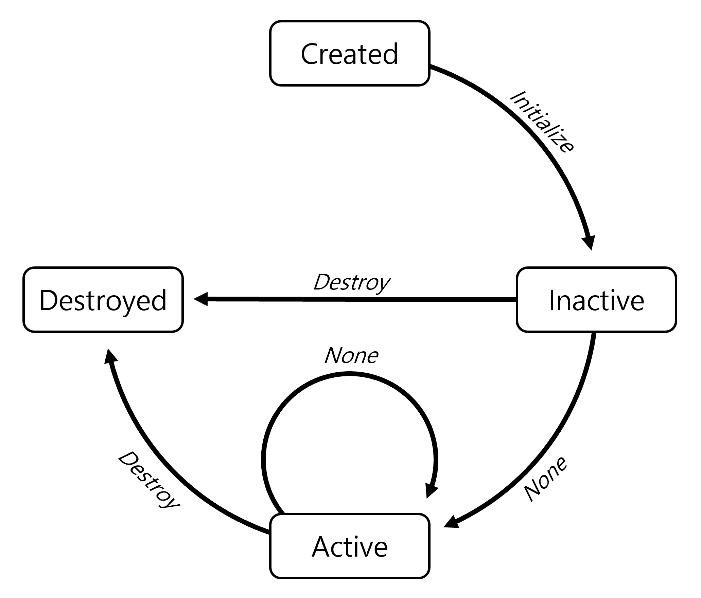
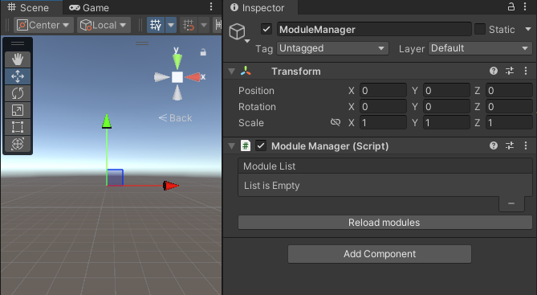
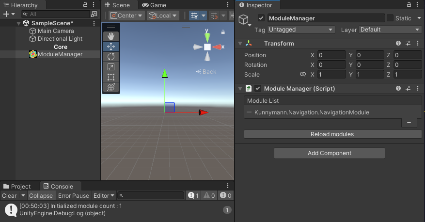
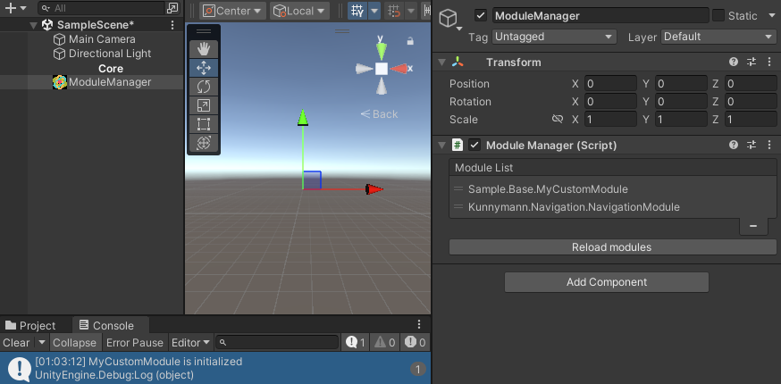
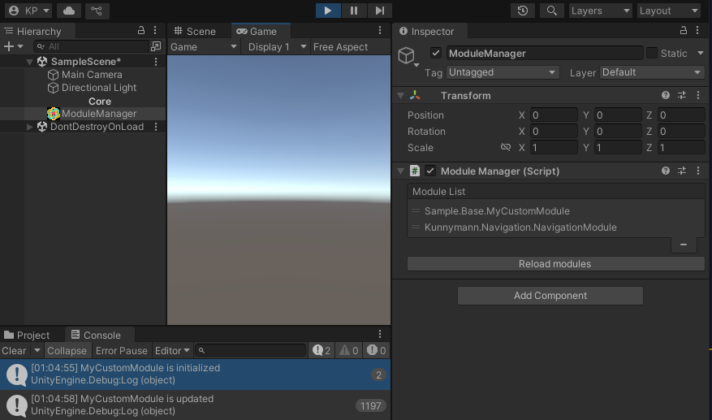

# Base

Module 형식의 패키지를 지원하기 위한 Core 패키지입니다. 기본적인 모듈 동작을 지원하며, 이들을 관리할 수 있는 매니저를 제공합니다.

또한, 해당 패키지를 통해 직접 모듈을 제작하는 확장성 또한 지원합니다.

## How to use



패키지에서 동작하는 모든 Module들은 **ModuleBase** 를 상속받은 형태로 구현되었습니다. 위 도식은 Unity 이벤트 사이클에 맞게 동작하는 ModuleBase의 State machine을 보여주고 있습니다.

각 Module들은 독립적인 **Main thread concurrent queue** 를 소유하고 있어, Unity 이벤트에 맞게 이벤트를 발행합니다.

아래는 **ModuleManager** 를 통해, 현재 구현된 모듈들을 모두 로드하고 제작할 서비스에 맞게 선택하여 사용하는 예제입니다.



Scene에서 빈 오브젝트를 생성한 후, `ModuleManager` 컴포넌트를 할당합니다. 그리고, 현재 사용 중인 모듈들을 수집하기 위해서 **Reload modules** 을 누릅니다.



해당 프로젝트에서는 1개의 모듈만 사용하고 있습니다. 따라서, Scene에는 1개의 모듈만 직렬화됩니다.

> [!TIP]
> 사용을 원치 않는 모듈에 대해서는 Module List에서 삭제할 수 있습니다.

이제, 모듈을 직접 만들어 봅시다.

```csharp
using Kunnymann.Base;
using System;
using UnityEngine;

namespace Sample.Base
{
    [Serializable]
    public class MyCustomModule : ModuleBase
    {
        public override void ModuleInitialize()
        {
            base.ModuleInitialize();
            Debug.Log("MyCustomModule is initialized");
        }

        public override void ModuleUpdate()
        {
            base.ModuleUpdate();

            Debug.Log("MyCustomModule is updated");
        }
    }
}
```

> [!IMPORTANT]
> Serializable attribute는 필수적입니다.

Unity 이벤트 사이클에서 호출되는 ModuleInitialize, ModuleUpdate가 정상적으로 호출되는지 확인합니다.



에디터 모드에서도 모듈이 초기화되면, `ModuleInitialize` 이벤트는 호출됩니다.



플레이 모드에서도 모듈 이벤트가 정상적으로 호출되는 것을 확인할 수 있습니다.

> [!WARNING]
> ModuleBase는 ScriptableObject를 상속받아 구현되었고, 생성자에서 초기화 명령을 수행합니다.
> 따라서, Unity가 컴파일 과정 이후 여러번 초기화 명령을 수행할 수 있습니다.