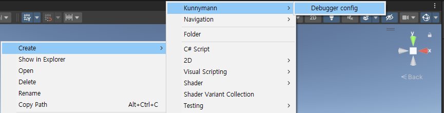
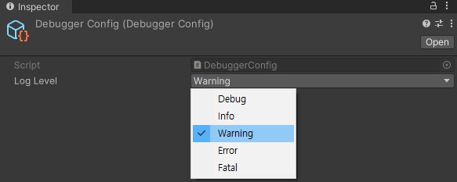
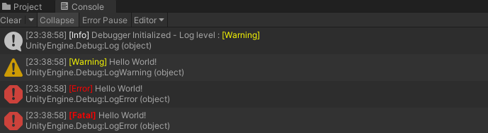

# Debugger

서비스 개발에 필요한 디버거 기능을 제공하는 패키지입니다.

**Log level** 을 지원하여, 서비스 개발에 필요한 로그 필터링 기능을 지원하고 별도의 에러 리스너 구축을 구성할 수 있습니다.

## How to use (LogLevel)



로그 필터링 기능을 사용하기 위해, **Resource** 폴더에 **DebuggerConfig** 파일을 생성합니다. 해당 파일은 Singleton 방식으로 참조 받기 때문에, 프로젝트 별로 **오직 하나의 파일** 만 존재해야 합니다.

이제, 코드를 작성해봅시다.

```csharp
using System;
using UnityEngine;
using Kunnymann.Debugger;

namespace Sample.Base
{
    public class DebuggerSample : MonoBehaviour
    {
        private void Start()
        {
            Debugger.Debug("Hello World!");
            Debugger.Info("Hello World!");
            Debugger.Warning("Hello World!");
            Debugger.Error("Hello World!");
            Debugger.Fatal("Hello World!");
        }
    }
}
```

작성된 코드를 Component로 할당한 후, 위에서 생성한 DebuggerConfig 파일로 접근하여 로그 레벨을 지정합니다.



이후, PlayMode에 진입하면 Warning 레벨 이상의 정보가 로그에 찍히는 것을 확인할 수 있습니다.



> [!IMPORTANT]
> 만약, 패키지에서 Sample을 Import하였다면, 삭제해주세요 (Resources 내용 중복).

## How to use (ErrorListener)

에러 리스너를 사용하기 위해서는, Error 타입을 사전에 정의해 놓을 필요가 있습니다. 여러분 서비스에서 발생할 수 있는 다양한 에러를 먼저 파악한 후, 작성하시길 바랍니다.

```csharp
using System;
using UnityEngine;
using Kunnymann.Debugger;

namespace Sample.Base
{
    public enum SampleError
    {
        NullReference,
        InvalidOperation,
        ArgumentOutOfRange
    }

    public class DebuggerSample : MonoBehaviour
    {
        private void Start()
        {
            ErrorListener.Check(SampleError.NullReference, "Invoke error handling", true, false);
        }
    }
}
```

`ErrorListener.Check` 는 사용자 정의의 Enum 타입, 메세지, Error로 Throw할 지 여부, 그리고 **Log package** 를 통해 로그 서버에 리포팅 할 지 여부를 결정합니다.


> [!NOTE]
> Log Package는 아직 미구현된 패키지 입니다 (25.03.04).

## 포함된 라이브러리

| Name           | License | Copyright |
|----------------|---------|-----------|
| Kunnymann Base |         |           |