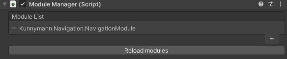
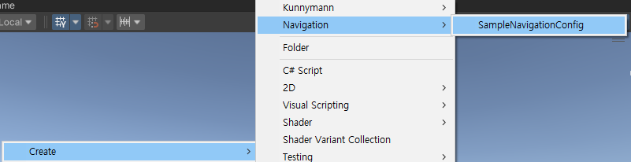
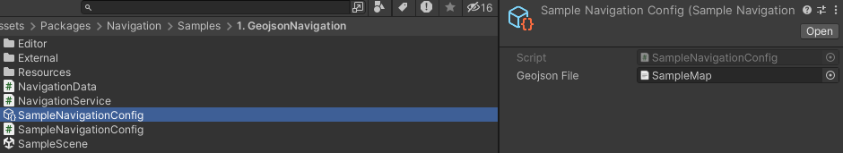
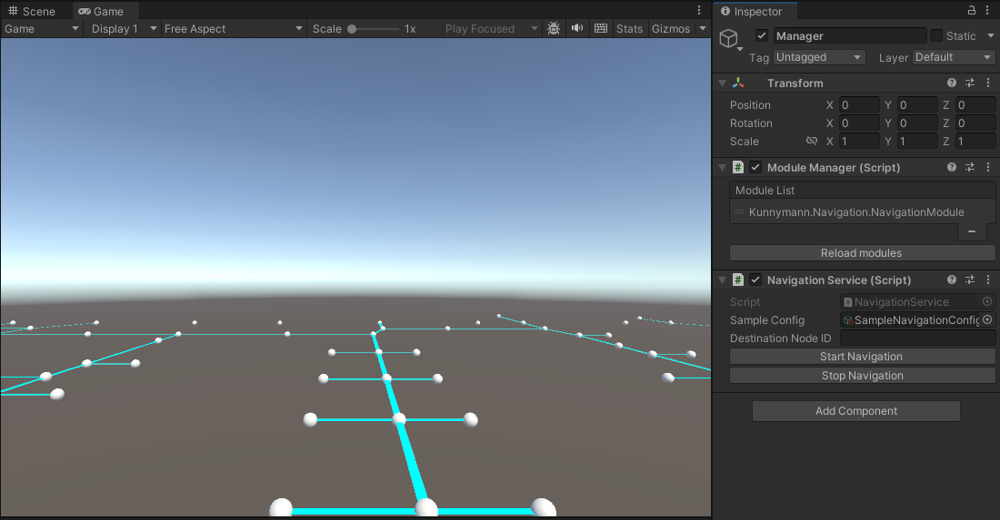
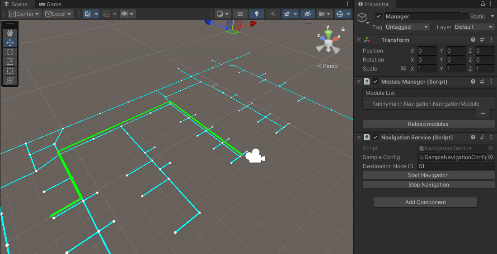
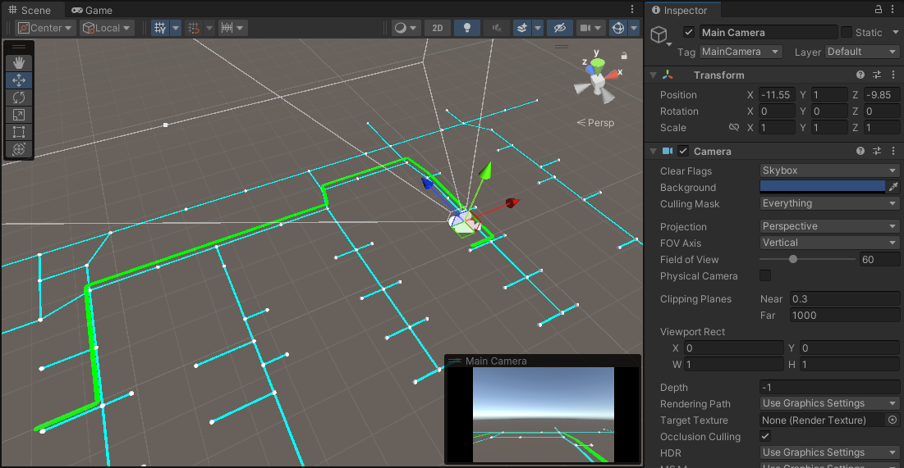

# Navigation

A* 알고리즘 기반 네비게이션 엔진을 제공하는 모듈입니다.

## How to use



네비게이션 모듈을 사용하기 위해서는, 네비게이션 모듈을 **ModuleManager** 를 통해 등록해야 합니다.

> [!IMPORTANT]
> ModuleManager는 Base 패키지가 필요합니다.

네비게이션을 진행하기 전에, 기본적으로 **Node** 데이터와 **Link** 데이터가 필요합니다.
- Node : 경로를 구성하게 될, 정점 데이터
- Link : 실제 Path를 그리게 될 경로 데이터

Node와 Link 데이터는 `NavigationConfig` 로 구성되게 되며, 해당 스크립트는 Node, Link의 RawData를 참조하여 데이터를 직렬화시키는 역할을 수행하게 됩니다.

아래는 Geojson 포멧의 RawData 예시입니다.

```json
{
    "type": "FeatureCollection",
    "features": [
      {
        "type": "Feature",
        "properties": {
          "id": 0,
          "linked":"[13,44,79]"
        },
        "geometry": {
          "coordinates": [
            -6.24,
            -13.81
          ],
          "type": "Point"
        }
      },
      {
        "type": "Feature",
        "properties": {
          "id": 2,
          "linked":"[42]",
          "poi": "{
            "dpName": "Vincent",
            "type": "slack",
            "src": "U0716J4DYB1",
            "description": "Vincent is a very nice person"
          }"
        },
        "geometry": {
          "coordinates": [
            -8.79,
            -13.53
          ],
          "type": "Point"
        }
      },
...
}
```

위 Geojson 파일은 직접적으로 Link 데이터를 소유하고 있는 구조가 아닌, Node 데이터 내에서 인접 Node 데이터를 직접 참조하므로써, Link 데이터를 만드는 구조입니다.

여러분의 데이터 규격과 서비스 정책에 따라, 사용 방식이 달라질 수 있습니다. 해당 가이드는 **엔진 사용법** 에 대해서 포커스를 맞춰 작성되었으니 참고하시면 되겠습니다.

이제, 코드를 작성해봅시다.

```csharp
using System.Collections.Generic;
using System.Linq;
using GeoJSON;
using Kunnymann.Navigation.Data;
using UnityEngine;

namespace Sample.Navigation
{
    [CreateAssetMenu(fileName = "SampleNavigationConfig", menuName = "Navigation/SampleNavigationConfig")]
    public class SampleNavigationConfig : NavigationConfig
    {
        [SerializeField] private TextAsset geojsonFile;

        private List<INode> _nodes;
        private List<ILink> _links;

        public override void Initialize()
        {
            Load();
        }

        public override List<ILink> GetLinkContainer()
        {
            return _links;
        }

        public override List<INode> GetNodeContainer()
        {
            return _nodes;
        }

        private void Load()
        {
            // Node, Link 데이터 초기화
        }
    }
}
```

이제, 구현한 Configuration을 Asset으로 생성합니다.



생성된 Configuration asset에 Geojson 포멧의 데이터를 참조시킵니다.



이제, 기본적으로 네비게이션 엔진을 사용할 수 있는 환경은 구성되었습니다.

서비스의 구성에 따라, 다양한 방식으로 네비게이션 서비스를 표현할 수 있겠습니다만, 본 문서에서는 패키지 내 Sample에 구성된 에디터 코드를 활용하여 시각효과를 대체토록 하였습니다.

그럼, 실제 엔진 사용 예제 코드를 확인해보겠습니다.

```csharp
using Kunnymann.Base;
using Kunnymann.Navigation.Data;
using System.Linq;
using UnityEngine;

namespace Sample.Navigation
{
    public class NavigationService : NavigationBehaviour
    {
        private void Start()
        {
            Navigation = ModuleManager.Instance.GetModule<NavigationModule>();

            // 해당 스크립트를 네비게이션 이벤트 핸들러로 등록합니다.
            // 이후, 다양한 네비게이션 이벤트와 정보를 쉽게 전달받아 서비스 코드를 쉽게 구현할 수 있습니다.
            Navigation.RegisterBehavour(this);

            // 네비게이션을 Ready 상태로 돌입시킵니다.
            // NavigationConfig로 기본적인 데이터 형태를 알려주고, 네비게이션 진행 주체는 메인 카메라가 될 것입니다.
            Navigation.Ready(_sampleConfig, Camera.main.transform);
            DrawNavigationConfig();
        }

        // 목적지를 입력 받아, Path를 설정하고 네비게이션을 실행합니다.
        public void StartNavigation(INode destination)
        {
            Navigation.SetupPath(destination, TransitionType.Path);
            Navigation.Start()
        }
    }
}
```

`NavigationBehaviour` 는 `INavigationEventHandler` 를 구현한 Navigation 전용 Monobehaviour입니다.

Unity 컴포넌트로 사용할 수 있는 동시에, 네비게이션 이벤트에 맞게 서비스 동작을 수행할 수 있도록 지원합니다.

이제 Playmode에 진입하여, 네비게이션을 테스트 할 수 있게 되었습니다.



> [!NOTE]
> 샘플에서는 RawData를 직접 렌더링하여, 실제 데이터 구성을 보여줍니다.

에디터에 원하는 목적지를 넣고, 네비게이션을 테스트를 수행해 보겠습니다.



단순 길 찾기 이외, 재탐색 기능도 존재합니다.

일정 거리 이상 멀어지면, 해당 위치 기준으로 근접한 Link를 탐색을 하고, 이 Link 바탕으로 경로를 재탐색하게 됩니다.

아래는 위 네비게이션 결과 중, 강제적으로 카메라를 움직인 결과입니다.



동시에, 재탐색 이벤트가 발생하면서 여러분이 구현한 NavigationBehaviour가 `OnRecoveryPath` 를 구현했다면, 해당 순간에 이벤트가 호출될 것입니다.