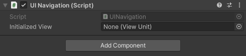
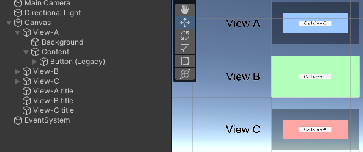
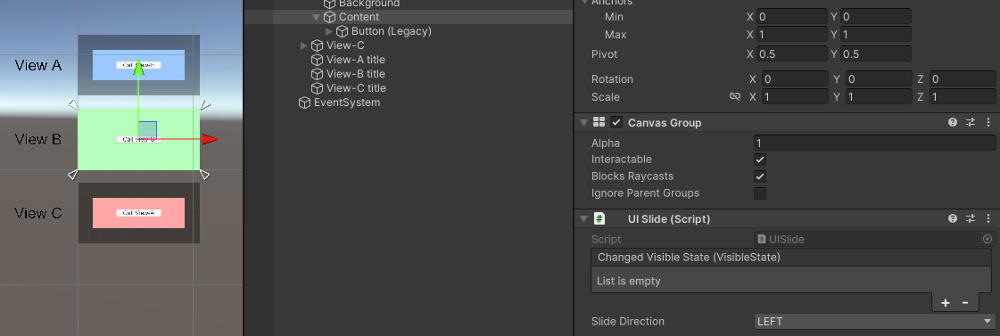
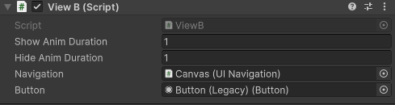
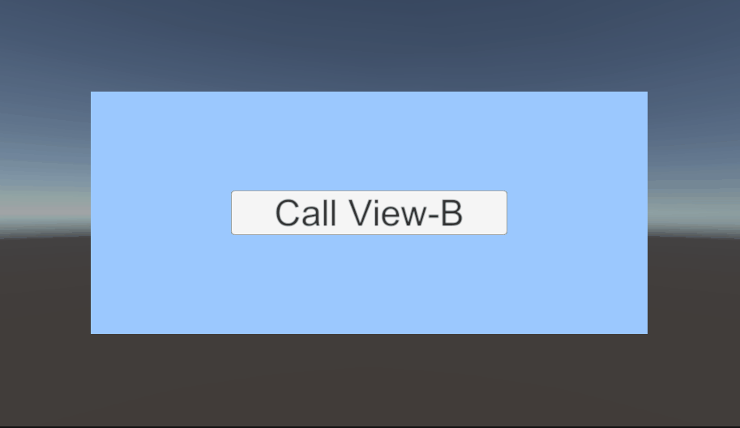
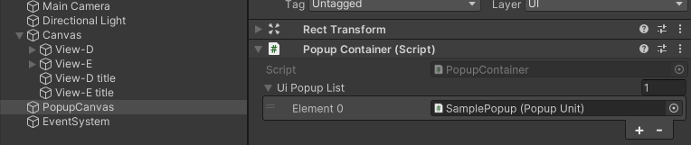
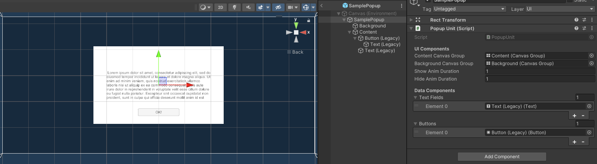
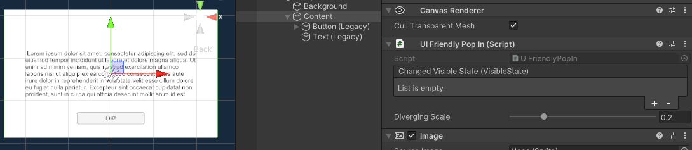
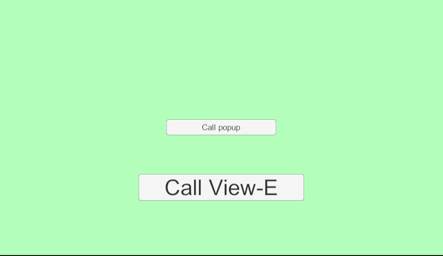

# UI Navigation

레트로님의 [UI Navigation](https://www.youtube.com/watch?v=_jW_D2vF9J8&t=5057s)으로부터 영감을 받아 제작한 UI method.

기본적인 화면 구성 단위 (View), View의 흐름을 관장하는 UI Navigation, 그리고 확장 가능한 Popup 기능을 지원합니다. 

## How to use (View)

화면 하나의 단위를 해당 패키지에서는 **View** 로 정의하겠습니다. 이 View를 구현하기 전에, View를 관리하는 별도의 Manager가 필요합니다.

**UI Navigation** 을 활용하면, 자식에 존재하는 View를 자동적으로 수집하고, 여러분의 서비스에 맞게 호출할 준비를 수행할 것입니다.



> [!IMPORTANT]
> 반드시 Canvas의 Component로 할당해주세요!

UI Navigation은 Playmode 진입 직후, 모든 View들을 **Hide** 처리하며 초기화를 진행합니다.

만약, 별도의 Hide 처리 없이 특정 View를 첫 화면으로 렌더링하고 싶다면, `Initialized View` 에 해당 UI Navigation에 존재하는 View를 할당해주세요.

이제 View를 구성해봅시다.



예제에서는 3개의 View를 구성하여, 콘텐츠와 배경 영역을 구분하였습니다.

3개의 View는 버튼을 통해, View들은 서로를 순회하게 됩니다.

해당 패키지에서는 View 사이의 전환을 위한 애니메이션 기능을 지원합니다. 여러분은 `UITransitionBase` 를 활용하여, 다양한 연출을 확장시킬 수 있습니다.

**View A** 에서 **View B** 로 전환될 때, View B가 왼쪽에서 슬라이딩하는 연출이 있으면 좋겠다고, 요구사항을 전달 받았음을 가정해봅시다.

우선, View B에 대한 스크립트를 작성해봅시다.

```csharp
using Kunnymann.UI.Navigation;
using UnityEngine;
using UnityEngine.UI;

namespace Sample.UI
{
    public class ViewB : ViewUnit
    {
        [SerializeField] private UINavigation _navigation;
        [SerializeField] private Button _button;

        protected override void Start()
        {
            base.Start();

            _button.onClick.AddListener(OnClickButton);
        }

        private void OnClickButton()
        {
            _navigation.Push<ViewC>("View-C");
        }
    }
}
```

보시는 바와 같이, `Navigation.Push<T>()` 를 통해서, 다음 View를 호출할 수 있음을 알 수 있습니다. 이 때, 파라미터는 실제 GameObject의 이름을 넘겨주도록 합니다.

결과적으로, 위 코드는 ViewB 내의 버튼을 눌렀을 때 UI Navigation으로부터 ViewC를 호출하게 될 것입니다.

이제 Scene view로 넘어가, **ViewB** GameObject에 작성한 Component를 할당한 후, 애니메이션 작업을 마무리 해줍시다.



**ViewB** 의 자식 GameObject인 Content에게 `UISlide` 를 할당하였습니다. 해당 Component는 `UITransitionBase` 를 상속한 애니메이션 클래스입니다. 

이제, View 전환 상황에서 ViewB의 Content 오브젝트는 보시는 바와 같이, 왼쪽에서 오른쪽으로 슬라이딩하는 애니메이션을 보여줄 것입니다.

물론, 이 연출 사이에 UITransitionBase는 State를 갖습니다. 이벤트를 전달받아, 필요한 상황에 활용할 수 있도록 열어두었습니다.

```csharp
public enum VisibleState
{
    /// <summary>
    /// Appearing
    /// </summary>
    Appearing,
    /// <summary>
    /// Appeared
    /// </summary>
    Appeared,
    /// <summary>
    /// Disappearing
    /// </summary>
    Disappearing,
    /// <summary>
    /// Disappeared
    /// </summary>
    Disappeared,
}
```

Content 오브젝트와 같이, 다른 자식 오브젝트인 Background도 비슷한 방식으로 연출을 추가시킬 수 있습니다.

마지막으로, ViewB의 연출 시간을 설정합니다.



Show, Hide Duration을 적절하게 설정하였으면, 모든 준비는 끝이 납니다.

추가로, View 또한 `VisibleState` 를 멤버로 갖고 있으며, `ChangedVisibleState` 이벤트를 지원합니다. 다만, 자기 자신이 아닌, **가장 첫 번째 인덱스의 UITransitionBase** 의 필드를 참조하고 있습니다.

Playmode에 진입하여 결과를 확인해봅니다.



성공적입니다!

## How to use (Popup)

이제 **Popup** 을 사용해 봅시다.

> [!TIP]
> Popup은 독립적인 Canvas에서 작업할 것을 권장드립니다!

> [!TIP]
> UI navigation은 여러 오브젝트로 존재될 수 있습니다! 이는 선형적 연출 외, 그리드 형식의 연출을 지원하기 위함입니다.

일반적인 Popup은 중복적으로 나타나지 않으며, 특정 상황에서만 나타나곤 합니다 (e.g. 시스템 메시지, 다이얼로그 등등)

그러한 이유로, Popup은 **프리팹 을 통해 Instantiate** 하는 방식으로 구현되었습니다.

View가 UI Navigation로 매니징 된다면, Popup은 PopupContainer로 관리됩니다.



컨테이너에 `PopupUnit` 을 Component로 갖는 프리팹을 할당하면, 해당 Popup은 동작 준비를 완료한 상태가 됩니다.

간단히 아래와 같이 SingleButton Popup 프리팹을 구현하였습니다.



이제, `PopupUnit` Component를 할당하여, 각각 필요한 데이터를 바인딩하도록 합니다.

> [!TIP]
> Popup은 위에서 언급한 것과 같이 시스템 메시지, 다이얼로그와 같은 전역적이며 공통적인 속성을 갖고 있습니다.
> 그 안에서 Popup 내용과 동작 액션만 바뀔 뿐이죠.
> 이러한 이유로도 Prefab 방식을 채택하였습니다.

바인딩 데이터를 기반으로, Popup은 다양한 형태로 확장될 수 있습니다. 아래 코드는 View에서 특정 버튼을 눌러, Popup의 텍스트 필드와 버튼 동작을 **동적으로 할당** 시키는 예시입니다.

```csharp
private void OnClickPopupButton()
{
    var popup = PopupUnit.GetUIPopup("SamplePopup");

    popup.SetButtonEvent(() => popup.Hide().Forget())
         .SetText("You can change popup text!").Show(1).Forget();
}
```

`PopupUnit.GetUIPopup()` 메소드를 통해, **PopupContainer** 로부터 등록된 Popup을 호출할 수 있습니다. 파라미터는 프리팹 이름을 사용합니다.

Popup은 확장 메소드의 지원을 받기 때문에, 단일 리소스로 여러 동작을 표현할 수 있습니다. 위 예제는 첫 번째 바인딩된 버튼에 대해서는 'Popup 닫기' 이벤트를 할당하고 있고, 기존 Lorem Ipsum 텍스트를 다른 내용으로 바꾸기도 합니다.

> [!TIP]
> Popup은 위에서 언급한 것과 같이 시스템 메시지, 다이얼로그와 같은 전역적이며 공통적인 속성을 갖고 있습니다.

Popup 역시, View와 유사하게 `UITransitionBase` 를 사용할 수 있습니다.



이제, Playmode에서 확인해 봅시다!



## 포함된 라이브러리

| Name           | License | Copyright |
|----------------|---------|-----------|
| Kunnymann Base |         |           |
| UniRx          |         |           |
| UniTask        |         |           |
| DOTween        |         |           |